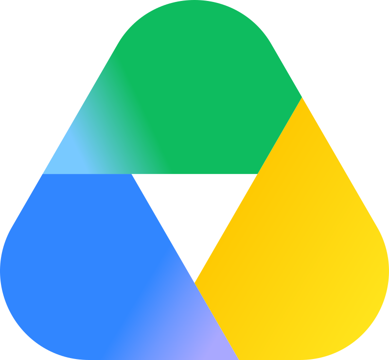

index.html:
```html
<!DOCTYPE html>
<html lang="pl">
<head>
  <meta charset="UTF-8" />
  <meta name="viewport" content="width=device-width, initial-scale=1.0" />
  <title>Dyskusyjny Klub Filmowy</title>
  <link rel="icon" type="image/png" href="favicon.png">
  <link rel="preconnect" href="https://fonts.googleapis.com" />
  <link rel="preconnect" href="https://fonts.gstatic.com" crossorigin />
  <link href="https://fonts.googleapis.com/css2?family=Playfair+Display:ital,wght@0,400;0,700;0,900;1,400;1,700&family=DM+Mono:wght@300;400;500&family=Barlow:wght@300;400;500;600&family=Google+Sans:wght@400;500&display=swap" rel="stylesheet" />
  <link rel="stylesheet" href="style.css" />
</head>

<body>
  <div class="grain-overlay"></div>

  <header>
    <div class="header-inner">
      <div class="header-logo">
        <span class="logo-dkf">DKF</span>
        <div class="logo-divider"></div>
        <div class="logo-text"><span class="logo-full">Piątek 19:00</span></div>
      </div>
    </div>
  </header>

  <main>
    <section class="upcoming-section">
      <div class="section-label">
        <span class="label-line"></span>
        <span class="label-text" id="label-upcoming" data-hint="Skopiuj listę nadchodzących spotkań">Nadchodzące spotkania</span>
        <span class="label-line"></span>
      </div>

      <div class="cards-grid" id="upcoming-cards"></div>

      <div class="empty-state hidden" id="upcoming-empty">
        <p>Brak zaplanowanych seansów. Wróć wkrótce.</p>
      </div>
    </section>

    <section class="download-section">
      <div class="section-label">
        <span class="label-line"></span>
        <a class="label-text label-link" href="https://drive.google.com/drive/folders/1pQmbtr6OxSjRZ9QuECT4Y2iY_wdzlDYW?usp=sharing" target="_blank" rel="noopener" data-hint="Dysk wymaga poproszenia o dostęp">Pobieranie filmów</a>
        <span class="label-line"></span>
      </div>

      <div class="cards-grid">
        <a class="drive-card" href="https://drive.google.com/drive/folders/1pQmbtr6OxSjRZ9QuECT4Y2iY_wdzlDYW?usp=sharing" target="_blank" rel="noopener" data-hint="Dysk wymaga poproszenia o dostęp">
          <div class="card-icon"></div>
          <h3 class="drive-title">Dysk Google</h3>
          <p class="drive-desc">Folder z omawianymi filmami</p>
        </a>
      </div>
    </section>

    <section class="archive-section">
      <div class="section-label section-label--archive-toggle">
        <span class="label-line"></span>
        <div class="archive-toggle" role="tablist" aria-label="Widok poprzednich spotkań">
          <button type="button" class="archive-toggle-option is-selected" id="toggle-meetings" role="tab" aria-selected="true" aria-controls="meetings-view" data-hint="Kliknij ponownie, aby skopiować listę spotkań">Spotkania</button>
          <span class="archive-toggle-divider" aria-hidden="true">|</span>
          <button type="button" class="archive-toggle-option" id="toggle-ranking" role="tab" aria-selected="false" aria-controls="ranking-view" data-hint="Przełącz na ranking">&nbsp;Ranking</button>
        </div>
        <span class="label-line"></span>
      </div>

      <div class="archive-view archive-view--meetings" id="meetings-view" role="tabpanel" aria-labelledby="toggle-meetings">
        <div class="filters" id="filters">
          <div class="filter-group">
            <span class="filter-label">Kraje</span>
            <div class="filter-countries" id="filter-countries"></div>
          </div>

          <div class="filter-group" id="filter-group-authors">
            <span class="filter-label">Propozycje</span>
            <div class="filter-authors" id="filter-authors"></div>
          </div>

          <div class="filter-group filter-group--year">
            <span class="filter-label">Rok produkcji</span>
            <div class="year-slider" id="year-slider">
              <div class="year-track">
                <div class="year-range" id="year-range"></div>
                <input type="range" id="year-min" class="year-input" />
                <input type="range" id="year-max" class="year-input" />
              </div>
              <div class="year-values">
                <span id="year-min-val">—</span>
                <span id="year-max-val">—</span>
              </div>
            </div>
          </div>

          <div class="filter-switches">
            <label class="switch-control">
              <input type="checkbox" id="show-all-toggle" />
              <span class="switch-track"><span class="switch-thumb"></span></span>
              <span class="switch-text">Wyróżnij</span>
            </label>
            <label class="switch-control">
              <input type="checkbox" id="poster-mode-toggle" />
              <span class="switch-track"><span class="switch-thumb"></span></span>
              <span class="switch-text">Plakaty</span>
            </label>
          </div>
        </div>

        <ul class="archive-list" id="archive-list"></ul>

        <div class="poster-grid hidden" id="archive-poster-grid"></div>

        <div class="empty-state hidden" id="archive-empty">
          <p>Brak omówionych filmów.</p>
        </div>
      </div>

      <div class="archive-view archive-view--ranking hidden" id="ranking-view" role="tabpanel" aria-labelledby="toggle-ranking">
        <div class="ranking-actions ranking-actions--top" id="ranking-actions">
          <button type="button" class="ranking-copy-btn" id="ranking-copy-btn" data-hint="Skopiuj listę filmów w rankingu">Skopiuj ranking</button>
          <button type="button" class="ranking-copy-btn ranking-code-btn" id="ranking-code-btn" data-hint="Skopiuj kod do przywracania rankingu">Skopiuj kod</button>
          <button type="button" class="ranking-copy-btn ranking-restore-btn" id="ranking-restore-btn" data-hint="Odtwórz ranking z kodu">Wczytaj z kodu</button>
        </div>

        <ul class="archive-list ranking-list" id="ranking-list"></ul>

        <div class="empty-state hidden" id="ranking-empty">
          <p>Brak filmów do ułożenia rankingu.</p>
        </div>
      </div>
    </section>
  </main>

  <script src="movies.js"></script>
  <script src="script.js"></script>
</body>
</html>
```

script.js:
```js
// DYSKUSYJNY KLUB FILMOWY — logika strony v8
const POLISH_MONTHS = [
  "stycznia", "lutego", "marca", "kwietnia", "maja", "czerwca",
  "lipca", "sierpnia", "września", "października", "listopada", "grudnia"
];
const RANKING_PREFIX = "Ranking DKF";

// DATE HELPERS
function parseDate(str) {
  const [d, m, y] = str.split(".").map(Number);
  return new Date(y, m - 1, d);
}
function isUpcoming(movieDate) {
  const today = new Date();
  today.setHours(0, 0, 0, 0);
  return movieDate >= today;
}
function getNextMovie(sortedMovies) {
  const today = new Date();
  today.setHours(0, 0, 0, 0);
  return sortedMovies.find(m => parseDate(m.date) >= today) || null;
}

// DISPLAY HELPERS
function displayName(movie) {
  return movie.altName ? `${movie.name} (${movie.altName})` : movie.name;
}
function extractFlags(movie) {
  if (!movie.flag) return [];
  return [...movie.flag.matchAll(/\p{Regional_Indicator}\p{Regional_Indicator}/gu)].map(m => m[0]);
}

// COPY FORMAT BUILDERS
function buildUpcomingCopyText(upcomingMovies) {
  return upcomingMovies
    .map(m => `### ${m.date}: [*${displayName(m)} [${m.year}]*](${m.filmweb})`)
    .join("  \n") + "  \n";
}
function buildArchiveCopyText(archiveMovies, globalIndexMap) {
  return [...archiveMovies]
    .reverse()
    .map(m => `${globalIndexMap.get(m)}. ${m.date}: ${displayName(m)} [${m.year}]`)
    .join("\n");
}
function buildRankingCopyText(rankingMovies, code) {
  const header = `${RANKING_PREFIX} {${code}}:`;
  const body = rankingMovies
    .map((m, i) => `${i + 1}. ${displayName(m)} [${m.year}]`)
    .join("\n");
  return `${header}\n${body}`;
}

// RANKING SEED CODE — encode order of movie indices into a short base36 string
function encodeRanking(orderIndices) {
  return orderIndices.map(i => i.toString(36).padStart(2, "0")).join("");
}
function decodeRanking(code) {
  const clean = code.trim().replace(/[^0-9a-z]/gi, "").toLowerCase();
  if (clean.length === 0 || clean.length % 2 !== 0) return null;
  const out = [];
  for (let i = 0; i < clean.length; i += 2) {
    const n = parseInt(clean.slice(i, i + 2), 36);
    if (Number.isNaN(n)) return null;
    out.push(n);
  }
  return out;
}
function extractCodeFromInput(raw) {
  const m = raw.match(/\{([^}]+)\}/);
  return m ? m[1] : raw;
}

// TOAST SYSTEM
let _toastTimer = null;
function showToast(message) {
  const footer = document.querySelector("footer");
  if (footer) {
    const toastMsg = footer.querySelector(".footer-toast-msg");
    toastMsg.textContent = message;
    footer.classList.add("toast-active");
    clearTimeout(_toastTimer);
    _toastTimer = setTimeout(() => footer.classList.remove("toast-active"), 2400);
    return;
  }
  const existing = document.getElementById("copy-toast");
  if (existing) existing.remove();
  const toast = document.createElement("div");
  toast.id = "copy-toast";
  toast.className = "copy-toast";
  toast.textContent = message;
  document.body.appendChild(toast);
  toast.getBoundingClientRect();
  toast.classList.add("visible");
  clearTimeout(_toastTimer);
  _toastTimer = setTimeout(() => {
    toast.classList.remove("visible");
    setTimeout(() => toast.remove(), 400);
  }, 2400);
}
async function copyToClipboard(text, toastMessage) {
  try {
    await navigator.clipboard.writeText(text);
  } catch {
    const ta = document.createElement("textarea");
    ta.value = text;
    ta.style.cssText = "position:fixed;opacity:0;pointer-events:none";
    document.body.appendChild(ta);
    ta.select();
    document.execCommand("copy");
    ta.remove();
  }
  showToast(toastMessage);
}

// HINT POPUP SYSTEM — small unobtrusive tooltip above element on hover
let _hintEl = null;
function getHintEl() {
  if (!_hintEl) {
    _hintEl = document.createElement("div");
    _hintEl.className = "hint-popup";
    _hintEl.setAttribute("aria-hidden", "true");
    document.body.appendChild(_hintEl);
  }
  return _hintEl;
}
function showHint(target) {
  const text = target.dataset.hint;
  if (!text) return;
  const hint = getHintEl();
  hint.textContent = text;
  const rect = target.getBoundingClientRect();
  hint.style.left = (rect.left + rect.width / 2) + "px";
  hint.style.top = (rect.top - 10) + "px";
  hint.getBoundingClientRect();
  hint.classList.add("is-visible");
}
function hideHint() {
  if (_hintEl) _hintEl.classList.remove("is-visible");
}
function attachHint(el) {
  el.addEventListener("mouseenter", () => showHint(el));
  el.addEventListener("mouseleave", hideHint);
  el.addEventListener("click", hideHint);
  el.addEventListener("focus", () => showHint(el));
  el.addEventListener("blur", hideHint);
}
function initHints() {
  document.querySelectorAll("[data-hint]").forEach(attachHint);
}

// CARD BUILDER (upcoming + poster-mode)
function buildCard(movie, opts = {}) {
  const date = parseDate(movie.date);
  const day = date.getDate();
  const monthFull = POLISH_MONTHS[date.getMonth()];
  const year = date.getFullYear();
  const today = new Date();
  today.setHours(0, 0, 0, 0);
  const isToday = date.getTime() === today.getTime();
  const isPast = date < today;
  const card = document.createElement("article");
  card.className = "movie-card" + (isToday ? " is-today" : "") + (isPast ? " is-past" : "");
  const numHtml = opts.count != null ? `<span class="card-count">#${opts.count}</span>` : "";
  card.innerHTML = `
    <div class="card-date">
      ${numHtml}
      <span class="date-day">${day}</span>
      <div class="date-gap"></div>
      <span class="date-month-year">${monthFull} ${year}</span>
      ${isToday ? '<span class="badge-today">‎ Dziś!</span>' : ""}
    </div>
    <div class="card-divider"></div>
    <div class="card-info">
      <h2 class="card-title">${movie.name}</h2>
      ${movie.altName ? `<p class="card-alt">${movie.altName}</p>` : ""}
      <p class="card-year">${movie.flag ? movie.flag + ' ' : ''}${movie.year}</p>
      ${movie.author ? `<p class="card-author">${movie.author}</p>` : ""}
    </div>
    <a class="card-link" href="${movie.filmweb}" target="_blank" rel="noopener" data-hint="Otwórz na Filmwebie">
      
    </a>
  `;
  card.querySelector(".card-link").addEventListener("click", e => e.stopPropagation());
  attachHint(card.querySelector(".card-link"));
  card.addEventListener("click", () => {
    copyToClipboard(`${displayName(movie)} [${movie.year}]`, `Skopiowano\n${displayName(movie)} [${movie.year}]`);
  });
  if (movie.poster) {
    card.style.setProperty('--poster-url', `url('${movie.poster}')`);
  }
  return card;
}

// POSTER-MODE CARD (archive, image-first / inverted on hover)
function buildPosterCard(movie, globalNum, dimmed) {
  const date = parseDate(movie.date);
  const day = date.getDate();
  const month = POLISH_MONTHS[date.getMonth()];
  const year = date.getFullYear();
  const card = document.createElement("article");
  card.className = "poster-card" + (dimmed ? " is-filtered-out" : "");
  card.innerHTML = `
    <div class="poster-card-img" style="${movie.poster ? `background-image:url('${movie.poster}')` : ''}">
      ${movie.poster ? "" : `<span class="poster-card-noimg">${movie.name}</span>`}
    </div>
    <div class="poster-card-overlay">
      <span class="poster-card-count">#${globalNum}</span>
      <h3 class="poster-card-title">${movie.name}</h3>
      ${movie.altName ? `<p class="poster-card-alt">${movie.altName}</p>` : ""}
      <p class="poster-card-meta">${movie.flag ? movie.flag + ' ' : ''}${movie.year}</p>
      <p class="poster-card-date">${day} ${month} ${year}</p>
      ${movie.author ? `<span class="poster-card-author">${movie.author}</span>` : ""}
      <a class="poster-card-link" href="${movie.filmweb}" target="_blank" rel="noopener" data-hint="Otwórz na Filmwebie">
        
      </a>
    </div>
  `;
  const link = card.querySelector(".poster-card-link");
  link.addEventListener("click", e => e.stopPropagation());
  attachHint(link);
  card.addEventListener("click", () => {
    copyToClipboard(`${displayName(movie)} [${movie.year}]`, `Skopiowano\n${displayName(movie)} [${movie.year}]`);
  });
  return card;
}

// ARCHIVE ITEM BUILDER
function buildArchiveItem(movie, globalNum, dimmed) {
  const date = parseDate(movie.date);
  const day = date.getDate();
  const month = POLISH_MONTHS[date.getMonth()];
  const year = date.getFullYear();
  const li = document.createElement("li");
  li.className = "archive-item" + (dimmed ? " is-filtered-out" : "");
  li.innerHTML = `
    <span class="archive-num">${globalNum}.</span>
    <span class="archive-date">${day} ${month} ${year}</span>
    <span class="archive-dot"></span>
    <span class="archive-title">
      ${movie.name}
      ${movie.altName ? `<span class="archive-alt">–&nbsp;&nbsp;${movie.altName}</span>` : ""}
      <span class="archive-year">${movie.flag ? movie.flag + ' ' : ''}${movie.year}</span>
    </span>
    ${movie.author ? `<span class="author-bubble">${movie.author}</span>` : '<span></span>'}
    <a href="${movie.filmweb}" target="_blank" rel="noopener" class="archive-link" data-hint="Otwórz na Filmwebie">
      
    </a>
  `;
  const link = li.querySelector(".archive-link");
  link.addEventListener("click", e => e.stopPropagation());
  attachHint(link);
  li.addEventListener("click", () => {
    copyToClipboard(`${displayName(movie)} [${movie.year}]`, `Skopiowano\n${displayName(movie)} [${movie.year}]`);
  });
  if (movie.poster) {
    attachPosterHover(li, movie);
  }
  return li;
}

// RANKING ITEM BUILDER
function buildRankingItem(movie, rank, movieKey, shouldSuppressClick) {
  const li = document.createElement("li");
  li.className = "archive-item ranking-item";
  li.draggable = true;
  li.dataset.movieKey = movieKey;
  li.innerHTML = `
    <span class="archive-num ranking-num">${rank}.</span>
    <span class="ranking-handle" aria-hidden="true" data-hint="Przeciągnij, aby zmienić pozycję">
      <svg width="14" height="20" viewBox="0 0 14 20" fill="none" xmlns="http://www.w3.org/2000/svg">
        <circle cx="4" cy="5" r="1.6" fill="currentColor"/>
        <circle cx="10" cy="5" r="1.6" fill="currentColor"/>
        <circle cx="4" cy="10" r="1.6" fill="currentColor"/>
        <circle cx="10" cy="10" r="1.6" fill="currentColor"/>
        <circle cx="4" cy="15" r="1.6" fill="currentColor"/>
        <circle cx="10" cy="15" r="1.6" fill="currentColor"/>
      </svg>
    </span>
    <span class="archive-title ranking-title">
      ${movie.name}
      ${movie.altName ? `<span class="archive-alt">–&nbsp;&nbsp;${movie.altName}</span>` : ""}
      <span class="archive-year">${movie.flag ? movie.flag + ' ' : ''}${movie.year}</span>
    </span>
    ${movie.author ? `<span class="author-bubble">${movie.author}</span>` : '<span></span>'}
    <a href="${movie.filmweb}" target="_blank" rel="noopener" class="archive-link" data-hint="Otwórz na Filmwebie" draggable="false">
      
    </a>
  `;
  const link = li.querySelector(".archive-link");
  link.addEventListener("click", e => e.stopPropagation());
  link.addEventListener("dragstart", e => e.preventDefault());
  attachHint(link);
  attachHint(li.querySelector(".ranking-handle"));
  li.addEventListener("click", () => {
    if (shouldSuppressClick && shouldSuppressClick()) return;
    copyToClipboard(`${displayName(movie)} [${movie.year}]`, `Skopiowano\n${displayName(movie)} [${movie.year}]`);
  });
  if (movie.poster) {
    attachPosterHover(li, movie);
  }
  return li;
}
function getDragAfterElement(container, y) {
  const draggableElements = [...container.querySelectorAll(".ranking-item:not(.is-dragging)")];
  return draggableElements.reduce((closest, child) => {
    const box = child.getBoundingClientRect();
    const offset = y - box.top - box.height / 2;
    if (offset < 0 && offset > closest.offset) return { offset, element: child };
    return closest;
  }, { offset: Number.NEGATIVE_INFINITY, element: null }).element;
}

// STICKY FOOTER
function isAnnouncementActive() {
  if (typeof ANNOUNCEMENT === "undefined" || !ANNOUNCEMENT || !ANNOUNCEMENT.trim()) return false;
  if (typeof ANNOUNCEMENT_EXPIRY === "undefined" || !ANNOUNCEMENT_EXPIRY) return true;
  const expiry = parseDate(ANNOUNCEMENT_EXPIRY);
  expiry.setHours(23, 59, 59, 999);
  return new Date() <= expiry;
}
function renderFooter(nextMovie) {
  const showAnnouncement = isAnnouncementActive();
  if (!showAnnouncement && !nextMovie) return;
  const footer = document.createElement("footer");
  if (showAnnouncement) {
    footer.classList.add("footer--announcement");
    footer.innerHTML = `
      <div class="footer-inner">
        <div class="footer-content">
          <span class="footer-label footer-announce-label"><span class="footer-announce-dot"></span>Ogłoszenie</span>
          <div class="footer-divider"></div>
          <span class="footer-announce-text">${ANNOUNCEMENT}</span>
        </div>
        <div class="footer-toast-msg" aria-live="polite"></div>
      </div>
    `;
  } else {
    const date = parseDate(nextMovie.date);
    const day = date.getDate();
    const monthFull = POLISH_MONTHS[date.getMonth()];
    const year = date.getFullYear();
    const today = new Date();
    today.setHours(0, 0, 0, 0);
    const isToday = date.getTime() === today.getTime();
    footer.innerHTML = `
      <div class="footer-inner">
        <div class="footer-content">
          <span class="footer-label">${isToday ? "Dzisiejszy seans" : "Następny seans"}</span>
          <div class="footer-divider"></div>
          <div class="footer-meta">
            <span class="footer-date">${day} ${monthFull} ${year}</span>
            <span class="footer-sep">·</span>
            <span class="footer-title">${nextMovie.name}</span>
            ${nextMovie.altName ? `<span class="footer-alt">${nextMovie.altName}</span>` : ""}
            <span class="footer-year">${nextMovie.year}</span>
          </div>
          <div class="footer-divider"></div>
          <a class="footer-fw-link" href="${nextMovie.filmweb}" target="_blank" rel="noopener" data-hint="Otwórz na Filmwebie">
            
          </a>
        </div>
        <div class="footer-toast-msg" aria-live="polite"></div>
      </div>
    `;
  }
  document.body.appendChild(footer);
  document.body.classList.add("has-footer");
}

// MAIN RENDER
function render() {
  const sorted = [...MOVIES].sort((a, b) => parseDate(a.date) - parseDate(b.date));
  const globalIndexMap = new Map();
  const movieKeyMap = new Map();
  const movieByKey = new Map();
  const movieByGlobalIndex = new Map();
  sorted.forEach((m, i) => {
    globalIndexMap.set(m, i + 1);
    const key = String(i);
    movieKeyMap.set(m, key);
    movieByKey.set(key, m);
    movieByGlobalIndex.set(i, m);
  });

  const upcomingMovies = sorted.filter(m => isUpcoming(parseDate(m.date)));
  const archiveMovies = sorted.filter(m => !isUpcoming(parseDate(m.date))).reverse();
  let rankingMovies = [...archiveMovies];

  renderFooter(getNextMovie(sorted));

  // UPCOMING CARDS
  const upcomingEl = document.getElementById("upcoming-cards");
  const upcomingEmpty = document.getElementById("upcoming-empty");
  if (upcomingMovies.length === 0) {
    upcomingEmpty.classList.remove("hidden");
  } else {
    upcomingMovies.forEach((m, i) => {
      const card = buildCard(m);
      card.style.animationDelay = `${i * 0.1}s`;
      upcomingEl.appendChild(card);
    });
  }

  // MEETINGS / ARCHIVE LIST + FILTERS
  const archiveEl = document.getElementById("archive-list");
  const posterGridEl = document.getElementById("archive-poster-grid");
  const archiveEmpty = document.getElementById("archive-empty");
  const filtersEl = document.getElementById("filters");
  const countriesEl = document.getElementById("filter-countries");
  const authorsEl = document.getElementById("filter-authors");
  const filterGroupAuthors = document.getElementById("filter-group-authors");
  const showAllToggle = document.getElementById("show-all-toggle");
  const posterModeToggle = document.getElementById("poster-mode-toggle");
  const yearSlider = document.getElementById("year-slider");
  const yearMinInput = document.getElementById("year-min");
  const yearMaxInput = document.getElementById("year-max");
  const yearRangeEl = document.getElementById("year-range");
  const yearMinVal = document.getElementById("year-min-val");
  const yearMaxVal = document.getElementById("year-max-val");

  const selectedCountries = new Set();
  const selectedAuthors = new Set();
  let yearLo, yearHi, yearBoundLo, yearBoundHi;

  function buildCountryFilter() {
    const present = new Set();
    const flagCount = new Map();
    archiveMovies.forEach(m => extractFlags(m).forEach(f => {
      if (COUNTRIES[f]) {
        present.add(f);
        flagCount.set(f, (flagCount.get(f) || 0) + 1);
      }
    }));
    countriesEl.innerHTML = "";
    if (present.size === 0) return;
    [...present].sort((a, b) => (flagCount.get(b) || 0) - (flagCount.get(a) || 0)).forEach(flag => {
      const count = flagCount.get(flag) || 0;
      const btn = document.createElement("button");
      btn.type = "button";
      btn.className = "country-chip";
      btn.title = COUNTRIES[flag];
      btn.innerHTML = `<span class="country-flag">${flag}</span><span class="country-count">${count}</span>`;
      btn.addEventListener("click", () => {
        if (selectedCountries.has(flag)) {
          selectedCountries.delete(flag);
          btn.classList.remove("is-active");
        } else {
          selectedCountries.add(flag);
          btn.classList.add("is-active");
        }
        renderArchiveList();
      });
      countriesEl.appendChild(btn);
    });
  }

  function buildAuthorFilter() {
    const authorCount = new Map();
    archiveMovies.forEach(m => {
      if (m.author && m.author.trim()) {
        const a = m.author.trim();
        authorCount.set(a, (authorCount.get(a) || 0) + 1);
      }
    });
    authorsEl.innerHTML = "";
    if (authorCount.size === 0) {
      filterGroupAuthors.classList.add("hidden");
      return;
    }
    filterGroupAuthors.classList.remove("hidden");
    [...authorCount.entries()]
      .sort((a, b) => b[1] - a[1])
      .forEach(([author, count]) => {
        const btn = document.createElement("button");
        btn.type = "button";
        btn.className = "author-chip";
        btn.title = author;
        btn.innerHTML = `<span class="author-chip-name">${author}</span><span class="country-count">${count}</span>`;
        btn.addEventListener("click", () => {
          if (selectedAuthors.has(author)) {
            selectedAuthors.delete(author);
            btn.classList.remove("is-active");
          } else {
            selectedAuthors.add(author);
            btn.classList.add("is-active");
          }
          renderArchiveList();
        });
        authorsEl.appendChild(btn);
      });
  }

  function buildYearSlider() {
    if (archiveMovies.length === 0) { yearSlider.classList.add("hidden"); return; }
    const years = archiveMovies.map(m => m.year);
    yearBoundLo = Math.min(...years);
    yearBoundHi = Math.max(...years);
    yearLo = yearBoundLo;
    yearHi = yearBoundHi;
    [yearMinInput, yearMaxInput].forEach(inp => {
      inp.min = yearBoundLo;
      inp.max = yearBoundHi;
      inp.step = 1;
    });
    yearMinInput.value = yearLo;
    yearMaxInput.value = yearHi;
    if (yearBoundLo === yearBoundHi) yearSlider.classList.add("year-slider--single");
    updateYearUI();
  }

  function updateYearUI() {
    yearMinVal.textContent = yearLo;
    yearMaxVal.textContent = yearHi;
    const span = Math.max(1, yearBoundHi - yearBoundLo);
    const left = ((yearLo - yearBoundLo) / span) * 100;
    const right = ((yearHi - yearBoundLo) / span) * 100;
    yearRangeEl.style.left = left + "%";
    yearRangeEl.style.right = (100 - right) + "%";
  }

  yearMinInput.addEventListener("input", () => {
    yearLo = Math.min(Number(yearMinInput.value), yearHi);
    yearMinInput.value = yearLo;
    updateYearUI();
    renderArchiveList();
  });
  yearMaxInput.addEventListener("input", () => {
    yearHi = Math.max(Number(yearMaxInput.value), yearLo);
    yearMaxInput.value = yearHi;
    updateYearUI();
    renderArchiveList();
  });

  function movieQualifies(m) {
    if (selectedCountries.size > 0) {
      const flags = extractFlags(m);
      if (!flags.some(f => selectedCountries.has(f))) return false;
    }
    if (selectedAuthors.size > 0) {
      const author = m.author ? m.author.trim() : "";
      if (!selectedAuthors.has(author)) return false;
    }
    if (typeof yearLo === "number" && (m.year < yearLo || m.year > yearHi)) return false;
    return true;
  }

  function renderArchiveList() {
    const posterMode = posterModeToggle.checked;
    archiveEl.innerHTML = "";
    posterGridEl.innerHTML = "";
    const showAll = showAllToggle.checked;
    let anyVisible = false;

    archiveMovies.forEach(m => {
      const ok = movieQualifies(m);
      if (!ok && !showAll) return;
      anyVisible = true;
      if (posterMode) {
        posterGridEl.appendChild(buildPosterCard(m, globalIndexMap.get(m), !ok));
      } else {
        archiveEl.appendChild(buildArchiveItem(m, globalIndexMap.get(m), !ok));
      }
    });

    archiveEmpty.classList.toggle("hidden", anyVisible);
    archiveEl.classList.toggle("hidden", !anyVisible || posterMode);
    posterGridEl.classList.toggle("hidden", !anyVisible || !posterMode);
  }

  showAllToggle.addEventListener("change", renderArchiveList);
  posterModeToggle.addEventListener("change", renderArchiveList);

  if (archiveMovies.length === 0) {
    filtersEl.classList.add("hidden");
    archiveEmpty.classList.remove("hidden");
  } else {
    buildCountryFilter();
    buildAuthorFilter();
    buildYearSlider();
    renderArchiveList();
  }

  // RANKING VIEW
  const meetingsView = document.getElementById("meetings-view");
  const rankingView = document.getElementById("ranking-view");
  const rankingEl = document.getElementById("ranking-list");
  const rankingEmpty = document.getElementById("ranking-empty");
  const rankingActions = document.getElementById("ranking-actions");
  const rankingCopyBtn = document.getElementById("ranking-copy-btn");
  const rankingCodeBtn = document.getElementById("ranking-code-btn");
  const rankingRestoreBtn = document.getElementById("ranking-restore-btn");
  const meetingsBtn = document.getElementById("toggle-meetings");
  const rankingBtn = document.getElementById("toggle-ranking");

  let currentArchiveView = "meetings";
  let isRankingDragging = false;
  let suppressNextRankingClick = false;

  function copyMeetings() {
    if (archiveMovies.length === 0) return;
    copyToClipboard(buildArchiveCopyText(archiveMovies, globalIndexMap), `Skopiowano listę poprzednich spotkań\n${archiveMovies.length} filmów`);
  }
  function currentRankingCode() {
    return encodeRanking(rankingMovies.map(m => globalIndexMap.get(m) - 1));
  }
  function copyRanking() {
    if (rankingMovies.length === 0) return;
    const code = currentRankingCode();
    copyToClipboard(buildRankingCopyText(rankingMovies, code), `Ranking skopiowany\nkod: ${code}`);
  }
  function copyRankingCode() {
    if (rankingMovies.length === 0) return;
    const code = currentRankingCode();
    copyToClipboard(code, `Kod skopiowany\n${code}`);
  }
  function restoreRanking() {
    const raw = window.prompt("Wklej kod rankingu lub całą pierwszą linię (Ranking DKF {kod}:)");
    if (raw == null) return;
    const code = extractCodeFromInput(raw);
    const order = decodeRanking(code);
    if (!order || order.length === 0) {
      showToast("Nieprawidłowy kod");
      return;
    }
    const restored = order.map(i => movieByGlobalIndex.get(i)).filter(Boolean);
    const missing = rankingMovies.filter(m => !restored.includes(m));
    rankingMovies = [...restored, ...missing];
    renderRankingList();
    showToast(`Ranking wczytany\n${restored.length} filmów`);
  }

  function setArchiveView(view) {
    currentArchiveView = view;
    const isMeetings = view === "meetings";
    meetingsView.classList.toggle("hidden", !isMeetings);
    rankingView.classList.toggle("hidden", isMeetings);
    meetingsBtn.classList.toggle("is-selected", isMeetings);
    rankingBtn.classList.toggle("is-selected", !isMeetings);
    meetingsBtn.setAttribute("aria-selected", String(isMeetings));
    rankingBtn.setAttribute("aria-selected", String(!isMeetings));
    meetingsBtn.dataset.hint = isMeetings ? "Skopiuj listę poprzednich spotkań" : "Przełącz na spotkania";
    rankingBtn.dataset.hint = !isMeetings ? "Skopiuj listę rankingu filmów" : "Przełącz na ranking";
  }

  function commitRankingOrderFromDom() {
    const reordered = [...rankingEl.querySelectorAll(".ranking-item")]
      .map(item => movieByKey.get(item.dataset.movieKey))
      .filter(Boolean);
    if (reordered.length === rankingMovies.length) rankingMovies = reordered;
    renderRankingList();
  }
  function finishRankingDrag() {
    const draggingEl = rankingEl.querySelector(".ranking-item.is-dragging");
    if (draggingEl) draggingEl.classList.remove("is-dragging");
    isRankingDragging = false;
    suppressNextRankingClick = true;
    commitRankingOrderFromDom();
    window.setTimeout(() => { suppressNextRankingClick = false; }, 80);
  }
  function renderRankingList() {
    rankingEl.innerHTML = "";
    const isEmpty = rankingMovies.length === 0;
    rankingEl.classList.toggle("hidden", isEmpty);
    rankingEmpty.classList.toggle("hidden", !isEmpty);
    rankingActions.classList.toggle("hidden", isEmpty);
    if (isEmpty) return;
    rankingMovies.forEach((m, i) => {
      const item = buildRankingItem(m, i + 1, movieKeyMap.get(m), () => suppressNextRankingClick);
      item.addEventListener("dragstart", e => {
        isRankingDragging = true;
        suppressNextRankingClick = false;
        item.classList.add("is-dragging");
        if (e.dataTransfer) {
          e.dataTransfer.effectAllowed = "move";
          e.dataTransfer.setData("text/plain", item.dataset.movieKey);
        }
      });
      item.addEventListener("dragend", () => { if (isRankingDragging) finishRankingDrag(); });
      rankingEl.appendChild(item);
    });
  }
  rankingEl.addEventListener("dragover", e => {
    const draggingEl = rankingEl.querySelector(".ranking-item.is-dragging");
    if (!draggingEl) return;
    e.preventDefault();
    if (e.dataTransfer) e.dataTransfer.dropEffect = "move";
    const afterElement = getDragAfterElement(rankingEl, e.clientY);
    if (afterElement == null) rankingEl.appendChild(draggingEl);
    else rankingEl.insertBefore(draggingEl, afterElement);
  });
  rankingEl.addEventListener("drop", e => {
    if (!isRankingDragging) return;
    e.preventDefault();
    finishRankingDrag();
  });

  renderRankingList();
  setArchiveView("meetings");

  meetingsBtn.addEventListener("click", () => {
    if (currentArchiveView === "meetings") copyMeetings();
    else setArchiveView("meetings");
  });
  rankingBtn.addEventListener("click", () => {
    if (currentArchiveView === "ranking") copyRanking();
    else setArchiveView("ranking");
  });
  rankingCopyBtn.addEventListener("click", copyRanking);
  rankingCodeBtn.addEventListener("click", copyRankingCode);
  rankingRestoreBtn.addEventListener("click", restoreRanking);

  document.getElementById("label-upcoming").addEventListener("click", () => {
    if (upcomingMovies.length === 0) return;
    const count = upcomingMovies.length;
    copyToClipboard(buildUpcomingCopyText(upcomingMovies), `Skopiowano listę nadchodzących spotkań\n${count} ${count === 1 ? "film" : "filmy"}`);
  });

  initHints();
}

// POSTER HOVER POPUP SYSTEM
const POPUP_W = 140;
const POPUP_GAP = 16;
const POPUP_MIN_SIDE_SPACE = POPUP_W + POPUP_GAP + 24;

let _posterPopup = null;
let _posterHideTimer = null;

function getPosterPopup() {
  if (!_posterPopup) {
    _posterPopup = document.createElement("div");
    _posterPopup.className = "poster-popup";
    _posterPopup.setAttribute("aria-hidden", "true");
    document.body.appendChild(_posterPopup);
  }
  return _posterPopup;
}

function showPosterPopup(el, movie) {
  const popup = getPosterPopup();

  const listRect = el.closest(".archive-list").getBoundingClientRect();
  const rightSpace = window.innerWidth - listRect.right;
  const leftSpace = listRect.left;
  const hasSpace = rightSpace >= POPUP_MIN_SIDE_SPACE || leftSpace >= POPUP_MIN_SIDE_SPACE;
  if (!hasSpace) return;

  clearTimeout(_posterHideTimer);

  popup.innerHTML = ``;
  popup.classList.add("is-loading");
  const img = popup.querySelector("img");
  img.onload = () => popup.classList.remove("is-loading");
  img.onerror = () => { popup.classList.remove("is-visible"); };

  const itemRect = el.getBoundingClientRect();
  const scrollY = window.scrollY;
  let left, right;

  if (rightSpace >= POPUP_MIN_SIDE_SPACE) {
    left = listRect.right + POPUP_GAP;
    right = "auto";
  } else {
    left = "auto";
    right = window.innerWidth - listRect.left + POPUP_GAP;
  }

  const popupH = Math.round(POPUP_W * 1.5);
  let top = itemRect.top + scrollY + itemRect.height / 2 - popupH / 2;
  const minTop = scrollY + 8;
  const maxTop = scrollY + window.innerHeight - popupH - 8;
  top = Math.max(minTop, Math.min(top, maxTop));

  popup.style.left = typeof left === "number" ? left + "px" : left;
  popup.style.right = typeof right === "number" ? right + "px" : right;
  popup.style.top = top + "px";
  popup.style.width = POPUP_W + "px";

  popup.getBoundingClientRect();
  popup.classList.add("is-visible");
}

function hidePosterPopup() {
  if (!_posterPopup) return;
  _posterHideTimer = setTimeout(() => {
    if (_posterPopup) _posterPopup.classList.remove("is-visible");
  }, 80);
}

function attachPosterHover(el, movie) {
  el.addEventListener("mouseenter", () => showPosterPopup(el, movie));
  el.addEventListener("mouseleave", hidePosterPopup);
}

document.addEventListener("DOMContentLoaded", render);
```

style.css:
```css
/* DYSKUSYJNY KLUB FILMOWY — style v8.1 */

:root {
  --bg:          #0c0b09;
  --bg-card:     #131210;
  --bg-card-h:   #1e1a14;
  --border:      #302a22;
  --border-h:    #5a4a34;
  --gold:        #d4a84c;
  --gold-dim:    #8a6e38;
  --gold-label:  #b99145;
  --gold-dark:   #6f5830;
  --gold-glow:   rgba(212, 168, 76, 0.14);
  --cream:       #f0e8d8;
  --muted:       #90806a;
  --text:        #d4cabb;
  --text-dim:    #665a4a;
  --fw-red:      #E4261A;
  --font-display: 'Playfair Display', Georgia, serif;
  --font-mono:    'DM Mono', 'Courier New', monospace;
  --font-body:    'Barlow', system-ui, sans-serif;
  --ease-smooth:  cubic-bezier(0.22, 1, 0.36, 1);
}

*, *::before, *::after { box-sizing: border-box; margin: 0; padding: 0; }

html {
  font-size: 18px;
  scroll-behavior: smooth;
}

body {
  background: var(--bg);
  color: var(--text);
  font-family: var(--font-body);
  font-weight: 300;
  min-height: 100vh;
  overflow-x: hidden;
}

body.has-footer main {
  padding-bottom: calc(clamp(2.5rem, 5vw, 4rem) + 76px) !important;
}

/* GRAIN OVERLAY */
.grain-overlay {
  pointer-events: none;
  position: fixed;
  inset: 0;
  z-index: 1000;
  opacity: 0.03;
  background-image: url("data:image/svg+xml,%3Csvg viewBox='0 0 256 256' xmlns='http://www.w3.org/2000/svg'%3E%3Cfilter id='noise'%3E%3CfeTurbulence type='fractalNoise' baseFrequency='0.9' numOctaves='4' stitchTiles='stitch'/%3E%3C/filter%3E%3Crect width='100%25' height='100%25' filter='url(%23noise)'/%3E%3C/svg%3E");
  background-size: 200px 200px;
}

/* HEADER */
header {
  position: sticky;
  top: 0;
  z-index: 100;
  background: rgba(12, 11, 9, 0.93);
  backdrop-filter: blur(16px);
  border-bottom: 1px solid var(--border);
}

.header-inner {
  max-width: 1100px;
  margin: 0 auto;
  padding: 0 clamp(1.25rem, 5vw, 4rem);
  height: 76px;
  display: flex;
  align-items: center;
  justify-content: center;
}

.header-logo {
  display: flex;
  align-items: center;
  gap: clamp(0.75rem, 2vw, 1.25rem);
  flex-wrap: wrap;
  justify-content: center;
}

.logo-dkf {
  font-family: var(--font-display);
  font-size: 2.4rem;
  font-weight: 900;
  color: var(--gold);
  letter-spacing: -0.02em;
  line-height: 1;
}

.logo-divider {
  width: 1px;
  height: 2rem;
  background: var(--border-h);
}

.logo-full {
  font-family: var(--font-mono);
  font-size: 0.72rem;
  font-weight: 400;
  letter-spacing: 0.22em;
  text-transform: uppercase;
  color: var(--muted);
}

/* MAIN */
main {
  max-width: 1100px;
  margin: 0 auto;
  padding: clamp(1.5rem, 3vw, 2.25rem) clamp(1.25rem, 5vw, 4rem) clamp(2.5rem, 5vw, 4rem);
  display: flex;
  flex-direction: column;
  gap: clamp(1.75rem, 3vw, 2.25rem);
}

/* SECTION LABELS */
.section-label {
  display: flex;
  align-items: center;
  gap: 1.5rem;
  margin-bottom: clamp(1.25rem, 2.5vw, 1.75rem);
}

.label-line {
  flex: 1;
  height: 1px;
  background: #3a3128;
  transition: background 0.3s ease;
}

.label-text {
  font-family: var(--font-mono);
  font-size: 0.72rem;
  font-weight: 500;
  letter-spacing: 0.25em;
  text-transform: uppercase;
  color: var(--gold-label);
  white-space: nowrap;
  cursor: pointer;
  user-select: none;
  position: relative;
  padding: 0.4em 0.8em;
  border-radius: 2px;
  transition: color 0.25s ease, text-shadow 0.25s ease;
}

.label-text::after {
  content: '';
  position: absolute;
  bottom: -2px;
  left: 0.8em;
  right: 0.8em;
  height: 1px;
  background: var(--gold-label);
  opacity: 0;
  transition: opacity 0.25s ease;
}

.label-link {
  text-decoration: none;
  display: inline-block;
}

.section-label:hover .label-text {
  color: var(--gold);
  text-shadow: 0 0 12px rgba(212, 168, 76, 0.7), 0 0 30px rgba(212, 168, 76, 0.35), 0 0 60px rgba(212, 168, 76, 0.15);
}

.section-label:hover .label-text::after { opacity: 1; }
.section-label:hover .label-line { background: var(--border-h); }

.section-label:active .label-text {
  color: var(--cream);
  text-shadow: 0 0 20px rgba(240, 232, 216, 0.6);
}

/* HINT POPUP — small unobtrusive tooltip */
.hint-popup {
  position: fixed;
  z-index: 2000;
  transform: translate(-50%, -100%) translateY(4px) scale(0.96);
  background: var(--bg-card-h);
  border: 1px solid var(--border-h);
  color: var(--cream);
  font-family: var(--font-mono);
  font-size: 0.6rem;
  font-weight: 400;
  letter-spacing: 0.08em;
  padding: 0.45em 0.8em;
  border-radius: 5px;
  white-space: nowrap;
  pointer-events: none;
  opacity: 0;
  box-shadow: 0 6px 20px rgba(0,0,0,0.5);
  transition: opacity 0.18s var(--ease-smooth), transform 0.18s var(--ease-smooth);
  max-width: 400px;
  overflow: hidden;
  text-overflow: ellipsis;
}

.hint-popup::after {
  content: '';
  position: absolute;
  top: 100%;
  left: 50%;
  transform: translateX(-50%);
  border: 5px solid transparent;
  border-top-color: var(--border-h);
}

.hint-popup.is-visible {
  opacity: 1;
  transform: translate(-50%, -100%) translateY(0) scale(1);
}

/* ARCHIVE / RANKING TOGGLE HEADER */
.archive-toggle {
  width: min(300px, 100%);
  display: grid;
  grid-template-columns: minmax(0, 1fr) auto minmax(0, 1fr);
  align-items: center;
  column-gap: 1.05rem;
}

.archive-toggle-divider {
  justify-self: center;
  font-family: var(--font-mono);
  font-size: 0.72rem;
  color: var(--gold-label);
  transition: color 0.25s ease, text-shadow 0.25s ease;
}

.archive-toggle-option {
  appearance: none;
  border: none;
  background: transparent;
  font-family: var(--font-mono);
  font-size: 0.72rem;
  font-weight: 500;
  letter-spacing: 0.25em;
  text-transform: uppercase;
  color: var(--gold-dark);
  cursor: pointer;
  user-select: none;
  padding: 0.4em 0.1em;
  border-radius: 2px;
  transition: color 0.25s ease, text-shadow 0.25s ease, opacity 0.2s ease;
}

.archive-toggle-option:first-child { justify-self: end; text-align: right; }
.archive-toggle-option:last-child { justify-self: start; text-align: left; }

.archive-toggle-option.is-selected {
  color: var(--gold);
  text-shadow: 0 0 12px rgba(212, 168, 76, 0.55), 0 0 30px rgba(212, 168, 76, 0.22);
}

.archive-toggle-option:not(.is-selected):hover { color: var(--gold-label); }
.archive-toggle-option:active { opacity: 0.7; }

.section-label:hover .archive-toggle-divider {
  color: var(--gold);
  text-shadow: 0 0 12px rgba(212, 168, 76, 0.35);
}

/* style.css */

/* CARDS GRID */
.cards-grid {
  display: flex;
  flex-wrap: wrap;
  gap: 1.5rem;
  justify-content: center;
}

.cards-grid > * {
  flex: 1 1 calc((100% - 3rem) / 3 - 1px);
  max-width: 320px;
}

.download-section .cards-grid > * {
  width: auto;
  flex: 0 1 320px;
  min-width: 280px;
}

/* MOVIE CARD */
.movie-card {
  background: var(--bg-card);
  border: 1px solid var(--border);
  border-radius: 3px;
  width: 100%;
  min-height: 420px;
  display: flex;
  flex-direction: column;
  align-items: center;
  text-align: center;
  overflow: hidden;
  position: relative;
  cursor: pointer;
  transition: border-color 0.3s ease, transform 0.4s var(--ease-smooth), box-shadow 0.4s var(--ease-smooth), background 0.3s ease;
  animation: fadeInUp 0.5s ease both;
}

.movie-card::before {
  content: '';
  position: absolute;
  inset: 0;
  background-image: linear-gradient(180deg, rgba(19, 18, 16, 0.4) 0%, rgba(19, 18, 16, 0.85) 100%), var(--poster-url, none);
  background-size: cover;
  background-position: center;
  opacity: 0.3;
  filter: grayscale(0.2);
  transition: opacity 0.4s ease, filter 0.4s ease;
  z-index: 0;
}

.movie-card::after {
  content: '';
  position: absolute;
  top: 0;
  left: 0;
  right: 0;
  height: 2px;
  background: linear-gradient(90deg, transparent, var(--gold-dim), transparent);
  opacity: 0;
  transition: opacity 0.3s ease;
  z-index: 2;
}

.movie-card:hover {
  border-color: var(--border-h);
  transform: translateY(-6px);
  box-shadow: 0 26px 70px rgba(0,0,0,0.72), 0 6px 22px rgba(0,0,0,0.4), 0 0 0 1px var(--border-h);
  background: var(--bg-card-h);
}

.movie-card:hover::before {
  background-image: linear-gradient(180deg, rgba(19, 18, 16, 0.1) 0%, rgba(19, 18, 16, 0.45) 100%), var(--poster-url, none);
  opacity: 1;
  filter: grayscale(0);
}

/* HOVER EFFECT: Makes details transparent to reveal the background, but uses high-contrast drop contours for clarity */
.movie-card:hover .date-day,
.movie-card:hover .date-month-year,
.movie-card:hover .card-title,
.movie-card:hover .card-alt,
.movie-card:hover .card-year {
  opacity: 0.75;
  text-shadow:
    0 1px 2px rgba(12, 11, 9, 0.95),  /* Sharp black contour boundary */
    0 3px 8px rgba(12, 11, 9, 0.8),   /* Dark focus barrier */
    0 8px 20px rgba(12, 11, 9, 0.6);  /* Wide ambient drop overlay */
}

.movie-card:hover::after { opacity: 1; }

.movie-card.is-today {
  border-color: var(--gold-dim);
  box-shadow: 0 0 0 1px var(--gold-dim), 0 0 50px var(--gold-glow);
}

.movie-card.is-today::after {
  opacity: 1;
  background: linear-gradient(90deg, transparent, var(--gold), transparent);
}

.movie-card.is-past { opacity: 0.72; }

.movie-card > * {
  position: relative;
  z-index: 1;
}

.card-date {
  width: 100%;
  padding: 0.5rem 1.5rem 1rem;
  display: flex;
  flex-direction: column;
  align-items: center;
  background: linear-gradient(180deg, rgba(212,168,76,0.06) 0%, transparent 100%);
  position: relative;
}

.card-count {
  position: absolute;
  top: 0.6rem;
  right: 0.9rem;
  font-family: var(--font-mono);
  font-size: 0.7rem;
  font-weight: 500;
  letter-spacing: 0.08em;
  color: var(--gold-dim);
  background: rgba(48, 42, 34, 0.55);
  border: 1px solid rgba(212, 168, 76, 0.18);
  padding: 0.2em 0.55em;
  border-radius: 999px;
  backdrop-filter: blur(4px);
}

.date-day {
  font-family: var(--font-display);
  font-size: 6rem;
  font-weight: 900;
  color: var(--cream);
  line-height: 1;
  letter-spacing: -0.04em;
  transition: opacity 0.35s var(--ease-smooth), text-shadow 0.35s var(--ease-smooth);
}

.date-gap { height: 0.9rem; }

.date-month-year {
  font-family: var(--font-mono);
  font-size: 0.85rem;
  font-weight: 400;
  color: var(--gold-dim);
  letter-spacing: 0.22em;
  text-transform: uppercase;
  line-height: 1;
  transition: opacity 0.35s var(--ease-smooth), text-shadow 0.35s var(--ease-smooth);
}

.badge-today {
  display: inline-block;
  margin-top: 1rem;
  font-family: var(--font-mono);
  font-size: 0.6rem;
  letter-spacing: 0.2em;
  text-transform: uppercase;
  background: var(--gold);
  color: var(--bg);
  padding: 0.3em 0.9em;
  border-radius: 1px;
  font-weight: 500;
}

.card-divider {
  width: calc(100% - 2.5rem);
  height: 1px;
  background: linear-gradient(90deg, transparent, var(--border-h), transparent);
  margin: 1.25rem 0 0;
}

.card-info {
  padding: 1.75rem 1.5rem;
  display: flex;
  flex-direction: column;
  align-items: center;
  justify-content: center;
  gap: 0.75rem;
  flex: 1;
  width: 100%;
}

.card-title {
  font-family: var(--font-display);
  font-size: 1.75rem;
  font-weight: 700;
  color: var(--cream);
  line-height: 1.2;
  letter-spacing: -0.01em;
  transition: opacity 0.35s var(--ease-smooth), text-shadow 0.35s var(--ease-smooth);
}

/* main card altName — NOT italic, same display font as title, distinct colour */
.card-alt {
  font-family: var(--font-display);
  font-style: normal;
  font-size: 1.1rem;
  color: var(--gold-label);
  line-height: 1.3;
  transition: opacity 0.35s var(--ease-smooth), text-shadow 0.35s var(--ease-smooth);
}

.card-year {
  font-family: var(--font-mono);
  font-size: 0.8rem;
  font-weight: 400;
  color: var(--text-dim);
  letter-spacing: 0.18em;
  margin-top: 0.6rem;
  transition: opacity 0.35s var(--ease-smooth), text-shadow 0.35s var(--ease-smooth);
}

.card-author {
  font-family: var(--font-mono);
  font-size: 0.7rem;
  font-weight: 400;
  letter-spacing: 0.15em;
  color: var(--cream);
  padding: 0.3em 0.85em;
  border-radius: 999px;
  margin-top: 0.3rem;
  line-height: 1.4;

  /* Transitions */
  transition: opacity 0.3s ease, text-shadow 0.3s ease, background 0.3s ease, border-color 0.3s ease;

  /* --- High Transparency, Low Blur Glass --- */
  background: rgba(12, 11, 9, 0.45);   /* Darker backing for contrast */
  -webkit-backdrop-filter: blur(1px);  /* Safari support */
  backdrop-filter: blur(1px);          /* 1px blur */
  
  /* Delicate light-catching rim */
  border: 1px solid rgba(240, 232, 218, 0.15); 
  
  /* Specular top reflection + soft drop shadow */
  box-shadow: 
    0 3px 8px rgba(0, 0, 0, 0.3), 
    inset 0 1px 0 rgba(255, 255, 255, 0.12);
}

.card-link {
  width: 100%;
  display: flex;
  align-items: center;
  justify-content: center;
  padding: 0.8rem 1.5rem;
  border-top: 1px solid var(--border);
  transition: background 0.2s ease;
  margin-top: auto;
  text-decoration: none;
}

.card-link:hover { background: rgba(212,168,76,0.06); }

.filmweb-logo-full {
  height: 29px;
  width: auto;
  display: block;
  transition: transform 0.25s var(--ease-smooth), filter 0.25s ease;
}

.card-link:hover .filmweb-logo-full {
  transform: scale(1.08);
  filter: drop-shadow(0 0 8px rgba(212, 169, 76, 0.368)) drop-shadow(0 0 24px rgba(212, 168, 76, 0.12));
}

/* POSTER GRID (archive poster mode) — inverse of upcoming: image first, dim+info on hover */
.poster-grid {
  display: flex;
  flex-wrap: wrap;
  gap: 1.1rem;
  justify-content: center;
  animation: fadeInUp 0.4s var(--ease-smooth) both;
}

.poster-card {
  position: relative;
  width: calc((100% - 3.3rem) / 4);
  aspect-ratio: 2 / 3;
  border: 1px solid var(--border);
  border-radius: 3px;
  overflow: hidden;
  cursor: pointer;
  background: var(--bg-card);
  transition: border-color 0.3s ease, transform 0.4s var(--ease-smooth), box-shadow 0.4s var(--ease-smooth);
  animation: fadeInUp 0.4s var(--ease-smooth) both;
}

.poster-card:hover {
  border-color: var(--border-h);
  transform: translateY(-5px);
  box-shadow: 0 22px 60px rgba(0,0,0,0.7), 0 5px 18px rgba(0,0,0,0.4), 0 0 0 1px var(--border-h);
}

.poster-card.is-filtered-out { opacity: 0.38; }

.poster-card.is-filtered-out::after {
  content: '';
  position: absolute;
  inset: 0;
  z-index: 0; /* Sits above the image */
  pointer-events: none; /* Ensures the card is still clickable/hoverable */
  background: repeating-linear-gradient(
    -45deg,
    transparent,
    transparent 8px,
    rgba(0, 0, 0, 0.5) 8px,
    rgba(0, 0, 0, 0.5) 16px
  );
}

.poster-card-img {
  position: absolute;
  inset: 0;
  background-size: cover;
  background-position: center;
  display: flex;
  align-items: center;
  justify-content: center;
  transition: filter 0.4s ease, transform 0.5s var(--ease-smooth);
  background-color: var(--bg-card);
}

.poster-card:hover .poster-card-img {
  filter: brightness(0.22) grayscale(0.3);
  transform: scale(1.05);
}

.poster-card-noimg {
  font-family: var(--font-display);
  font-size: 1.1rem;
  color: var(--muted);
  text-align: center;
  padding: 1rem;
}

.poster-card-overlay {
  position: absolute;
  inset: 0;
  display: flex;
  flex-direction: column;
  align-items: center;
  justify-content: center;
  text-align: center;
  gap: 0.4rem;
  padding: 1rem;
  opacity: 0;
  transform: translateY(8px);
  transition: opacity 0.35s var(--ease-smooth), transform 0.35s var(--ease-smooth);
  z-index: 1;
}

.poster-card:hover .poster-card-overlay {
  opacity: 1;
  transform: translateY(0);
}

.poster-card-count {
  font-family: var(--font-mono);
  font-size: 0.65rem;
  font-weight: 500;
  letter-spacing: 0.1em;
  color: var(--gold);
  background: rgba(48, 42, 34, 0.5);
  border: 1px solid rgba(212, 168, 76, 0.25);
  padding: 0.2em 0.6em;
  border-radius: 999px;
  margin-bottom: 0.2rem;
}

.poster-card-title {
  font-family: var(--font-display);
  font-size: 1.15rem;
  font-weight: 700;
  color: var(--cream);
  line-height: 1.2;
}

.poster-card-alt {
  font-family: var(--font-display);
  font-style: normal;
  font-size: 0.85rem;
  color: var(--gold-label);
  line-height: 1.25;
}

.poster-card-meta {
  font-family: var(--font-mono);
  font-size: 0.68rem;
  font-weight: 400;
  letter-spacing: 0.12em;
  color: var(--text);
}

.poster-card-date {
  font-family: var(--font-mono);
  font-size: 0.6rem;
  font-weight: 400;
  letter-spacing: 0.08em;
  color: var(--muted);
}

.poster-card-author {
  font-family: var(--font-mono);
  font-size: 0.58rem;
  letter-spacing: 0.1em;
  color: var(--cream);
  background: rgba(48, 42, 34, 0.5);
  border: 1px solid rgba(212, 168, 76, 0.2);
  padding: 0.2em 0.65em;
  border-radius: 999px;
  margin-top: 0.15rem;
}

.poster-card-link {
  display: flex;
  align-items: center;
  justify-content: center;
  margin-top: 0.5rem;
  padding: 0.2rem;
  border-radius: 5px;
  text-decoration: none;
}

.poster-card-link:hover .filmweb-logo-sq {
  transform: scale(1.12);
  filter: drop-shadow(0 0 8px rgba(212, 169, 76, 0.368));
}

/* FILTERS */
.filters {
  display: flex;
  flex-wrap: wrap;
  align-items: flex-start;
  gap: 1.25rem 2rem;
  padding: 1.1rem 1.4rem;
  margin-bottom: 1.25rem;
  border: 1px solid var(--border);
  border-radius: 3px;
  background: var(--bg-card);
}

.filter-group {
  display: flex;
  flex-direction: column;
  gap: 0.6rem;
  min-width: 0;
}

.filter-group--year { flex: 1; min-width: 220px; }

.filter-label {
  font-family: var(--font-mono);
  font-size: 0.62rem;
  font-weight: 500;
  letter-spacing: 0.22em;
  text-transform: uppercase;
  color: var(--gold-label);
}

.filter-countries {
  display: flex;
  flex-wrap: wrap;
  gap: 0.4rem;
}

/* interactive chip = rounded; inner content blocks = squared */
.country-chip {
  appearance: none;
  border: 1px solid var(--border);
  background: var(--bg);
  border-radius: 999px;
  padding: 0.32rem 0.5rem 0.28rem;
  cursor: pointer;
  line-height: 1;
  font-size: 1rem;
  filter: grayscale(0.6);
  opacity: 0.6;
  display: flex;
  flex-direction: column;
  align-items: center;
  gap: 0.2rem;
  transition: opacity 0.2s ease, border-color 0.2s ease, filter 0.2s ease, transform 0.18s var(--ease-smooth), box-shadow 0.2s ease;
}

.country-chip:hover { opacity: 0.9; border-color: var(--border-h); transform: translateY(-2px); }

.country-chip.is-active {
  opacity: 1;
  filter: grayscale(0);
  border-color: var(--gold-dim);
  box-shadow: 0 0 14px var(--gold-glow);
}

.country-flag { font-size: 1.05rem; }

.country-count {
  font-family: var(--font-mono);
  font-size: 0.55rem;
  font-weight: 500;
  letter-spacing: 0.05em;
  color: var(--muted);
  line-height: 1;
}

/* AUTHOR FILTER CHIPS */
.filter-authors {
  display: flex;
  flex-wrap: wrap;
  gap: 0.4rem;
}

.author-chip {
  appearance: none;
  border: 1px solid var(--border);
  background: var(--bg);
  border-radius: 999px;
  padding: 0.32rem 0.7rem 0.28rem;
  cursor: pointer;
  line-height: 1;
  filter: grayscale(0.6);
  opacity: 0.6;
  display: flex;
  flex-direction: column;
  align-items: center;
  gap: 0.2rem;
  transition: opacity 0.2s ease, border-color 0.2s ease, filter 0.2s ease, transform 0.18s var(--ease-smooth), box-shadow 0.2s ease;
}

.author-chip:hover { opacity: 0.9; border-color: var(--border-h); transform: translateY(-2px); }

.author-chip.is-active {
  opacity: 1;
  filter: grayscale(0);
  border-color: var(--gold-dim);
  background: rgba(138, 110, 56, 0.18);
  box-shadow: 0 0 14px var(--gold-glow);
}

.author-chip-name {
  font-family: var(--font-mono);
  font-size: 0.68rem;
  font-weight: 400;
  letter-spacing: 0.08em;
  color: var(--text);
  line-height: 1.3;
}

.author-bubble {
  font-family: var(--font-mono);
  font-size: 0.6rem;
  font-weight: 400;
  letter-spacing: 0.1em;
  color: var(--cream);
  padding: 0.26em 0.7em;
  border-radius: 999px;
  white-space: nowrap;
  flex-shrink: 0;
  line-height: 1.4;
  align-self: center;
  transition: background 0.25s ease, border-color 0.25s ease, opacity 0.25s ease, text-shadow 0.25s ease;

  /* --- High Transparency, Low Blur Glass --- */
  background: rgba(12, 11, 9, 0.4);
  -webkit-backdrop-filter: blur(1px);
  backdrop-filter: blur(1px);
  border: 1px solid rgba(240, 232, 218, 0.12);
  box-shadow: 
    0 2px 6px rgba(0, 0, 0, 0.25),
    inset 0 1px 0 rgba(255, 255, 255, 0.1);
}

.archive-item:hover .author-bubble {
  /* Darkens slightly on hover to maintain legibility against highlighted backgrounds */
  background: rgba(12, 11, 9, 0.6);
  border-color: rgba(212, 168, 76, 0.25);
}

/* YEAR DUAL-SLIDER */
.year-slider { width: 100%; }

.year-track {
  position: relative;
  height: 1.4rem;
  display: flex;
  align-items: center;
}

.year-track::before {
  content: '';
  position: absolute;
  left: 0;
  right: 0;
  height: 3px;
  border-radius: 3px;
  background: var(--border);
}

.year-range {
  position: absolute;
  height: 3px;
  border-radius: 3px;
  background: var(--gold-dim);
}

.year-input {
  position: absolute;
  left: 0;
  width: 100%;
  margin: 0;
  background: none;
  pointer-events: none;
  -webkit-appearance: none;
  appearance: none;
}

.year-input::-webkit-slider-thumb {
  -webkit-appearance: none;
  appearance: none;
  pointer-events: auto;
  width: 16px;
  height: 16px;
  border-radius: 50%;
  background: var(--gold);
  border: 2px solid var(--bg);
  cursor: pointer;
  box-shadow: 0 0 8px var(--gold-glow);
  transition: transform 0.15s var(--ease-smooth);
}

.year-input::-webkit-slider-thumb:hover { transform: scale(1.15); }

.year-input::-moz-range-thumb {
  pointer-events: auto;
  width: 16px;
  height: 16px;
  border-radius: 50%;
  background: var(--gold);
  border: 2px solid var(--bg);
  cursor: pointer;
}

.year-input::-moz-range-track { background: transparent; }

.year-values {
  display: flex;
  justify-content: space-between;
  font-family: var(--font-mono);
  font-size: 0.72rem;
  font-weight: 400;
  color: var(--gold-dim);
  margin-top: 0.35rem;
}

.year-slider--single .year-input { display: none; }
.year-slider--single .year-track::before,
.year-slider--single .year-range { display: none; }
.year-slider--single .year-values { justify-content: center; }
.year-slider--single #year-max-val { display: none; }

/* FILTER SWITCHES */
.filter-switches {
  display: flex;
  flex-direction: column;
  gap: 0.7rem;
  align-self: flex-end;
}

.switch-control {
  display: flex;
  align-items: center;
  gap: 0.6rem;
  cursor: pointer;
  user-select: none;
}

.switch-control input { position: absolute; opacity: 0; pointer-events: none; }

.switch-track {
  position: relative;
  width: 36px;
  height: 20px;
  border-radius: 999px;
  background: var(--bg);
  border: 1px solid var(--border-h);
  flex-shrink: 0;
  transition: background 0.3s var(--ease-smooth), border-color 0.3s var(--ease-smooth);
}

.switch-thumb {
  position: absolute;
  top: 50%;
  left: 2px;
  transform: translateY(-50%);
  width: 14px;
  height: 14px;
  border-radius: 50%;
  background: var(--muted);
  transition: transform 0.3s var(--ease-smooth), background 0.3s var(--ease-smooth), box-shadow 0.3s var(--ease-smooth);
}

.switch-control input:checked + .switch-track {
  background: var(--gold-dim);
  border-color: var(--gold);
}

.switch-control input:checked + .switch-track .switch-thumb {
  transform: translateY(-50%) translateX(16px);
  background: var(--cream);
  box-shadow: 0 0 8px var(--gold-glow);
}

.switch-control:hover .switch-track { border-color: var(--gold-dim); }

.switch-text {
  font-family: var(--font-mono);
  font-size: 0.66rem;
  font-weight: 500;
  letter-spacing: 0.1em;
  text-transform: uppercase;
  color: var(--muted);
  transition: color 0.25s ease;
}

.switch-control input:checked ~ .switch-text { color: var(--gold-label); }

/* ARCHIVE — numbered list */
.archive-section { opacity: 0.95; }

.archive-list {
  list-style: none;
  border: 1px solid var(--border);
  border-radius: 3px;
  overflow: hidden;
  animation: fadeInUp 0.4s var(--ease-smooth) both;
}

.archive-item {
  display: grid;
  grid-template-columns: 2.5rem 165px auto 1fr auto auto;
  align-items: center;
  gap: 1rem;
  padding: 1rem 1.5rem;
  border-bottom: 1px solid var(--border);
  transition: background 0.2s ease, opacity 0.2s ease, box-shadow 0.25s ease;
  cursor: pointer;
}

.archive-item:last-child { border-bottom: none; }
.archive-item:hover {
  background: var(--bg-card);
  box-shadow: inset 0 0 0 1px var(--border-h), 0 6px 22px rgba(0,0,0,0.35);
}

.archive-item.is-filtered-out {
  opacity: 0.4;
  background: repeating-linear-gradient(
    -45deg,
    transparent,
    transparent 8px,
    rgba(212,168,76,0.04) 8px,
    rgba(212,168,76,0.04) 16px
  );
}

.archive-num {
  font-family: var(--font-mono);
  font-size: 0.72rem;
  font-weight: 500;
  color: var(--text-dim);
  text-align: right;
  white-space: nowrap;
}

.archive-date {
  font-family: var(--font-mono);
  font-size: 0.78rem;
  font-weight: 400;
  color: var(--muted);
  letter-spacing: 0.05em;
  white-space: nowrap;
}

.archive-dot {
  width: 3px;
  height: 3px;
  border-radius: 50%;
  background: var(--border-h);
  flex-shrink: 0;
}

.archive-title {
  font-family: var(--font-body);
  font-size: 1.05rem;
  color: var(--text);
  font-weight: 400;
}

/* archive altName — distinct colour, not italic */
.archive-alt {
  font-style: normal;
  color: var(--gold-label);
  margin-left: 0.4rem;
}

.archive-year {
  font-family: var(--font-mono);
  font-size: 0.72rem;
  font-weight: 400;
  color: var(--text-dim);
  margin-left: 0.5rem;
}

.archive-link {
  display: flex;
  align-items: center;
  text-decoration: none;
  padding: 0.2rem;
  border-radius: 3px;
}

.filmweb-logo-sq {
  width: 26px;
  height: 26px;
  display: block;
  transition: transform 0.2s var(--ease-smooth), filter 0.2s ease;
}

.archive-link:hover .filmweb-logo-sq {
  transform: scale(1.12);
  filter: drop-shadow(0 0 8px rgba(212, 169, 76, 0.368)) drop-shadow(0 0 24px rgba(212, 168, 76, 0.12));
}

/* RANKING */
.archive-view--ranking { display: block; }

.ranking-list { margin-top: 0; }

.ranking-item {
  grid-template-columns: 2.5rem 1.5rem minmax(0, 1fr) auto auto;
  cursor: grab;
  user-select: none;
}

.ranking-item:active { cursor: grabbing; }

.ranking-item.is-dragging {
  opacity: 0.52;
  background: var(--bg-card-h);
  box-shadow: inset 0 0 0 1px var(--border-h), 0 10px 30px rgba(0,0,0,0.5);
}

.ranking-num { color: var(--gold-label); }

.ranking-handle {
  display: flex;
  align-items: center;
  justify-content: center;
  color: var(--gold-dim);
  cursor: grab;
  opacity: 0.6;
  transition: color 0.2s ease, opacity 0.2s ease, transform 0.2s var(--ease-smooth);
}

.ranking-handle svg { display: block; }

.ranking-item:hover .ranking-handle { color: var(--gold); opacity: 1; transform: scale(1.1); }
.ranking-title { min-width: 0; }

/* RANKING ACTIONS */
.ranking-actions {
  display: flex;
  flex-wrap: wrap;
  justify-content: center;
  gap: 0.75rem;
}

.ranking-actions--top { margin-bottom: 1.25rem; }

.ranking-copy-btn {
  appearance: none;
  border: 1px solid var(--border-h);
  background: linear-gradient(180deg, var(--bg-card-h), var(--bg-card));
  color: var(--gold-label);
  font-family: var(--font-mono);
  font-size: 0.72rem;
  font-weight: 500;
  letter-spacing: 0.18em;
  text-transform: uppercase;
  padding: 0.85em 1.5em;
  border-radius: 999px;
  cursor: pointer;
  transition: color 0.25s ease, border-color 0.25s ease, background 0.25s ease, box-shadow 0.25s var(--ease-smooth), transform 0.18s var(--ease-smooth);
}

.ranking-copy-btn:hover {
  color: var(--gold);
  border-color: var(--gold-dim);
  background: linear-gradient(180deg, #26201780, var(--bg-card-h));
  box-shadow: 0 8px 28px rgba(0,0,0,0.4), 0 0 28px rgba(212, 168, 76, 0.12);
  transform: translateY(-2px);
}

.ranking-copy-btn:active { transform: translateY(-1px) scale(0.98); }

.ranking-restore-btn { color: var(--muted); }

/* DOWNLOAD SECTION */
.drive-card {
  display: flex;
  flex-direction: column;
  align-items: center;
  justify-content: center;
  text-align: center;
  background: var(--bg-card);
  border: 1px solid var(--border);
  border-radius: 3px;
  width: 100%;
  min-height: 160px;
  padding: 1.5rem 1rem;
  gap: 0.9rem;
  text-decoration: none;
  color: inherit;
  overflow: hidden;
  position: relative;
  transition: border-color 0.3s ease, transform 0.4s var(--ease-smooth), box-shadow 0.4s var(--ease-smooth), background 0.3s ease;
  animation: fadeInUp 0.5s ease both;
}

.drive-card::after {
  content: '';
  position: absolute;
  top: 0;
  left: 0;
  right: 0;
  height: 2px;
  background: linear-gradient(90deg, transparent, var(--gold-dim), transparent);
  opacity: 0;
  transition: opacity 0.3s ease;
}

.drive-card:hover {
  border-color: var(--border-h);
  transform: translateY(-6px);
  box-shadow: 0 26px 70px rgba(0,0,0,0.72), 0 6px 22px rgba(0,0,0,0.4), 0 0 0 1px var(--border-h);
  background: var(--bg-card-h);
}

.drive-card:hover::after { opacity: 1; }

.card-icon { padding: 0; }

.drive-icon-large {
  width: 5rem;
  height: auto;
  transition: filter 0.25s ease, transform 0.25s var(--ease-smooth);
}

.drive-card:hover .drive-icon-large {
  filter: drop-shadow(0 0 8px rgba(212, 169, 76, 0.368)) drop-shadow(0 0 24px rgba(212, 168, 76, 0.12));
  transform: scale(1.08);
}

.drive-title {
  font-family: 'Google Sans', 'Poppins', var(--font-body), sans-serif;
  font-weight: 500;
  font-size: 1.7rem;
  letter-spacing: -0.02em;
  color: var(--cream);
  line-height: 1.2;
  transition: color 0.25s ease, text-shadow 0.25s ease, transform 0.25s var(--ease-smooth);
}

.drive-card:hover .drive-title {
  color: var(--gold);
  text-shadow: 0 0 20px rgba(212, 168, 76, 0.4);
  transform: scale(1.04);
}

.drive-desc {
  font-family: var(--font-mono);
  font-size: 0.72rem;
  font-weight: 400;
  letter-spacing: 0.15em;
  text-transform: uppercase;
  color: var(--muted);
}

/* STICKY FOOTER */
footer {
  position: fixed;
  bottom: 0;
  left: 0;
  right: 0;
  z-index: 100;
  height: 76px;
  background: rgba(12, 11, 9, 0.93);
  backdrop-filter: blur(16px);
  border-top: 1px solid var(--border);
  overflow: hidden;
}

.footer-inner {
  position: relative;
  max-width: 1100px;
  margin: 0 auto;
  padding: 0 clamp(1.25rem, 5vw, 4rem);
  height: 100%;
}

.footer-content {
  display: flex;
  align-items: center;
  justify-content: center;
  gap: 1.25rem;
  height: 100%;
  transition: opacity 0.25s ease, transform 0.25s ease;
}

.footer-label {
  font-family: var(--font-mono);
  font-size: 0.65rem;
  font-weight: 500;
  letter-spacing: 0.22em;
  text-transform: uppercase;
  color: var(--muted);
  white-space: nowrap;
  flex-shrink: 0;
}

.footer-divider {
  width: 1px;
  height: 2rem;
  background: var(--border-h);
  flex-shrink: 0;
}

.footer-meta {
  display: flex;
  align-items: center;
  gap: 0.65rem;
  min-width: 0;
}

.footer-date {
  font-family: var(--font-mono);
  font-size: 0.72rem;
  font-weight: 400;
  color: var(--gold-dim);
  white-space: nowrap;
  flex-shrink: 0;
  letter-spacing: 0.05em;
}

.footer-sep { color: var(--border-h); font-size: 0.9rem; flex-shrink: 0; }

.footer-title {
  font-family: var(--font-display);
  font-size: 1.05rem;
  font-weight: 700;
  color: var(--cream);
  white-space: nowrap;
  overflow: hidden;
  text-overflow: ellipsis;
  min-width: 0;
}

.footer-alt {
  font-family: var(--font-display);
  font-style: normal;
  font-size: 0.85rem;
  color: var(--gold-label);
  white-space: nowrap;
  flex-shrink: 0;
}

.footer-year {
  font-family: var(--font-mono);
  font-size: 0.65rem;
  font-weight: 400;
  color: var(--text-dim);
  white-space: nowrap;
  flex-shrink: 0;
  letter-spacing: 0.1em;
}

.footer-fw-link {
  display: flex;
  align-items: center;
  flex-shrink: 0;
  text-decoration: none;
  transition: transform 0.2s var(--ease-smooth), filter 0.2s ease;
  border-radius: 4px;
}

.footer-fw-link:hover {
  transform: scale(1.1);
  filter: drop-shadow(0 0 8px rgba(212, 169, 76, 0.368)) drop-shadow(0 0 24px rgba(212, 168, 76, 0.12));
}

.footer-fw-icon { width: 36px; height: 36px; display: block; }

footer.toast-active .footer-content {
  opacity: 0;
  transform: translateY(10px);
  pointer-events: none;
}

.footer-toast-msg {
  position: absolute;
  inset: 0;
  display: flex;
  align-items: center;
  justify-content: center;
  opacity: 0;
  transform: translateY(-10px);
  transition: opacity 0.25s ease, transform 0.25s ease;
  pointer-events: none;
  font-family: var(--font-mono);
  font-size: 0.72rem;
  font-weight: 500;
  letter-spacing: 0.2em;
  text-transform: uppercase;
  color: var(--gold);
  white-space: pre-line;
  text-align: center;
}

footer.toast-active .footer-toast-msg { opacity: 1; transform: translateY(0); }

/* TOAST — floating fallback */
.copy-toast {
  position: fixed;
  bottom: 2rem;
  left: 50%;
  transform: translateX(-50%) translateY(1rem);
  background: var(--bg-card-h);
  border: 1px solid var(--gold-dim);
  color: var(--gold);
  font-family: var(--font-mono);
  font-size: 0.72rem;
  font-weight: 500;
  letter-spacing: 0.15em;
  text-transform: uppercase;
  padding: 0.75em 1.5em;
  border-radius: 2px;
  box-shadow: 0 8px 32px rgba(0,0,0,0.5), 0 0 20px rgba(212,168,76,0.1);
  opacity: 0;
  transition: opacity 0.3s ease, transform 0.3s ease;
  z-index: 9999;
  white-space: pre-line;
  pointer-events: none;
  text-align: center;
}

.copy-toast.visible { opacity: 1; transform: translateX(-50%) translateY(0); }

/* EMPTY STATE */
.empty-state {
  font-family: var(--font-mono);
  font-size: 0.85rem;
  font-weight: 400;
  color: var(--text-dim);
  letter-spacing: 0.1em;
  text-align: center;
  padding: 3rem 1rem;
}

/* POSTER HOVER POPUP */
.poster-popup {
  position: absolute;
  top: 0;
  left: 0;
  width: 140px;
  border-radius: 3px;
  overflow: hidden;
  border: 1px solid var(--border-h);
  box-shadow:
    0 12px 40px rgba(0, 0, 0, 0.7),
    0 0 0 1px rgba(212, 168, 76, 0.08),
    0 0 32px rgba(212, 168, 76, 0.06);
  background: var(--bg-card);
  opacity: 0;
  transform: translateY(6px) scale(0.97);
  transition:
    opacity 0.2s var(--ease-smooth),
    transform 0.2s var(--ease-smooth);
  pointer-events: none;
  z-index: 500;
}

.poster-popup::before {
  content: '';
  position: absolute;
  top: 0;
  left: 0;
  right: 0;
  height: 2px;
  background: linear-gradient(90deg, transparent, var(--gold-dim), transparent);
  z-index: 1;
  opacity: 0.7;
}

.poster-popup.is-visible {
  opacity: 1;
  transform: translateY(0) scale(1);
}

.poster-popup-img {
  display: block;
  width: 100%;
  aspect-ratio: 2 / 3;
  object-fit: cover;
  object-position: center top;
  background: var(--bg-card);
}

.poster-popup.is-loading .poster-popup-img {
  opacity: 0;
}

.hidden { display: none !important; }

/* ANIMATIONS */
@keyframes fadeInUp {
  from { opacity: 0; transform: translateY(24px); }
  to   { opacity: 1; transform: translateY(0); }
}

/* FOOTER — ANNOUNCEMENT MODE */
footer.footer--announcement {
  border-top-color: var(--gold-dim);
  background: rgba(12, 11, 9, 0.96);
}

footer.footer--announcement::before {
  content: '';
  position: absolute;
  top: 0;
  left: 0;
  right: 0;
  height: 1px;
  background: linear-gradient(90deg, transparent, var(--gold), transparent);
  opacity: 0.6;
}

.footer-announce-label {
  display: flex;
  align-items: center;
  gap: 0.55em;
  color: var(--gold) !important;
  letter-spacing: 0.28em !important;
  text-shadow: 0 0 12px rgba(212, 168, 76, 0.55), 0 0 30px rgba(212, 168, 76, 0.2);
}

.footer-announce-dot {
  display: inline-block;
  width: 5px;
  height: 5px;
  border-radius: 50%;
  background: var(--gold);
  flex-shrink: 0;
  box-shadow: 0 0 6px rgba(212, 168, 76, 0.8);
  animation: announcePulse 2s ease-in-out infinite;
}

@keyframes announcePulse {
  0%, 100% { opacity: 1;   box-shadow: 0 0 6px  rgba(212, 168, 76, 0.8); }
  50%      { opacity: 0.4; box-shadow: 0 0 12px rgba(212, 168, 76, 0.3); }
}

.footer-announce-text {
  font-family: var(--font-body);
  font-size: 0.98rem;
  font-weight: 400;
  color: var(--cream);
  white-space: nowrap;
  overflow: hidden;
  text-overflow: ellipsis;
  min-width: 0;
  letter-spacing: 0.01em;
}

@media (max-width: 640px) {
  .footer-announce-label { display: none; }
  .footer--announcement .footer-divider { display: none; }
  .footer-announce-text { font-size: 0.88rem; }
}

/* RESPONSIVE */
@media (max-width: 900px) {
  .poster-card { width: calc((100% - 2.2rem) / 3); }
}

@media (max-width: 640px) {
  html { font-size: 16px; }

  .cards-grid { gap: 1.25rem; }
  .cards-grid > * { flex: 1 1 100%; max-width: none; }
  .download-section .cards-grid > * { width: 100%; max-width: none; }

  .poster-grid { gap: 0.8rem; }
  .poster-card { width: calc((100% - 0.8rem) / 2); }

  .date-day { font-size: 5rem; }
  .card-title { font-size: 1.45rem; }

  .archive-toggle { width: min(360px, 100%); column-gap: 0.65rem; }
  .archive-toggle-option,
  .archive-toggle-divider { font-size: 0.68rem; letter-spacing: 0.18em; }

  .filters { padding: 1rem; gap: 1rem; }
  .filter-switches { align-self: flex-start; flex-direction: row; gap: 1.25rem; flex-wrap: wrap; }

  .archive-item {
    grid-template-columns: 2rem 1fr auto auto;
    grid-template-rows: auto auto;
    gap: 0.15rem 0.75rem;
    padding: 0.85rem 1rem;
  }

  .archive-num   { grid-column: 1; grid-row: 1 / 3; align-self: center; }
  .archive-date  { grid-column: 2; grid-row: 2; font-size: 0.7rem; }
  .archive-dot   { display: none; }
  .archive-title { grid-column: 2; grid-row: 1; }
  .author-bubble { grid-column: 3; grid-row: 1 / 3; align-self: center; }
  .archive-link  { grid-column: 4; grid-row: 1 / 3; align-self: center; }

  .ranking-item {
    grid-template-columns: 2rem 1.5rem minmax(0, 1fr) auto auto;
    grid-template-rows: auto;
    gap: 0.5rem;
  }

  .ranking-item .archive-num   { grid-column: 1; grid-row: 1; align-self: center; }
  .ranking-handle               { grid-column: 2; grid-row: 1; }
  .ranking-item .archive-title  { grid-column: 3; grid-row: 1; }
  .ranking-item .author-bubble  { grid-column: 4; grid-row: 1; align-self: center; }
  .ranking-item .archive-link   { grid-column: 5; grid-row: 1; align-self: center; }

  .footer-label,
  .footer-alt,
  .footer-year { display: none; }

  .footer-divider:first-of-type { display: none; }
  .footer-title { font-size: 0.9rem; }
}
```

